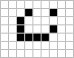
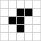

# Game of Life

## Introduction
The Game of Life, also known simply as Life, is a cellular automaton conceived by the British mathematician John Horton Conway in 1970. It's a zero-player game, meaning that its evolution is determined by its initial state, requiring no further input. This is a simple implementation of the Game of Life using Python and Pygame.


## Getting Started
### Prerequisites
- Python 3.x
- Numpy
- Pygame

### Installation
Clone the repository to your local machine:

```bash
git clone https://github.com/tomcastigl/GameofLife
```
### Running the Game
To start the game, run:
```python
python main.py
```

## Controls
- **Left Click:** Make a cell alive.
- **Right Click:** Make a cell dead.
- **Enter:** Start the simulation.

## Cool Initial States to Try
1. **Glider**:


2. **Spaceships (Lightweight spaceship)**:


3. **R-pentamino** (1'103 gen):


4. **Lidka** (29'200 gen):


and my favorite: the **Pi-heptomino** (173 gen):  

