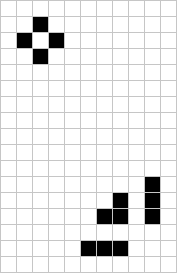

# Game of Life

## Introduction
# Game of Life

The Game of Life, also known simply as Life, is a cellular automaton conceived by the British mathematician John Horton Conway in 1970. It's a zero-player game, meaning that its evolution is determined by its initial state, requiring no further input. This is a simple implementation of the Game of Life with periodic boundary conditions (Pac-Man style) using Python and Pygame.

## Rules of the Game of Life

The universe of the Game of Life is a two-dimensional grid of square cells, each of which is in one of two possible states: alive or dead. Every cell interacts with its eight neighbors, which are the cells that are horizontally, vertically, or diagonally adjacent. At each step in time, the following transitions occur:

1. **Birth**: A dead cell with exactly three live neighbors becomes a live cell (as if by reproduction).
2. **Survival**: A live cell with two or three live neighbors stays alive for the next generation. Otherwise, it dies.

The initial pattern constitutes the 'seed' of the system. The first generation is created by applying the above rules simultaneously to every cell in the seed—births and deaths occur simultaneously. The rules continue to be applied repeatedly to create further generations.

With the periodic boundary conditions in this implementation, the grid behaves like a torus: cells on the edges of the grid are considered adjacent to the opposite edge, creating a continuous, looping play area.


## Getting Started
### Prerequisites
- Python 3.x
- Numpy
- Pygame

### Installation
Clone the repository to your local machine:

```bash
git clone https://github.com/tomcastigl/GameofLife
```
### Running the Game
To start the game, run:
```python
python main.py
```

## Controls
- **Left Click:** Make a cell alive.
- **Right Click:** Make a cell dead.
- **Enter:** Start the simulation.

## Cool Initial States to Try
1. **Glider**:


2. **Spaceships (Lightweight spaceship)**:


3. **R-pentamino** (1'103 gen):


4. **Lidka** (29'200 gen):


and my favorite: the **Pi-heptomino** (173 gen):  

